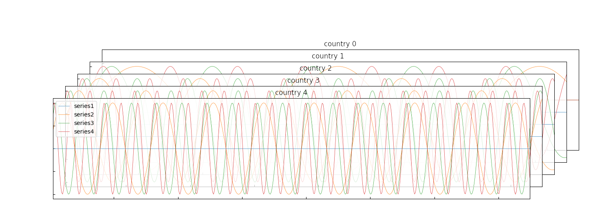
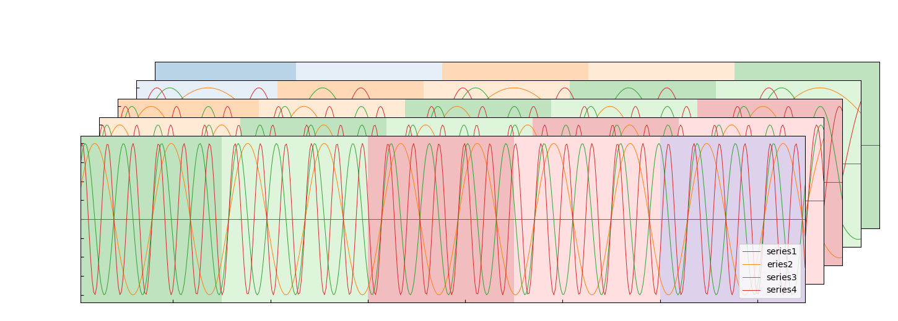
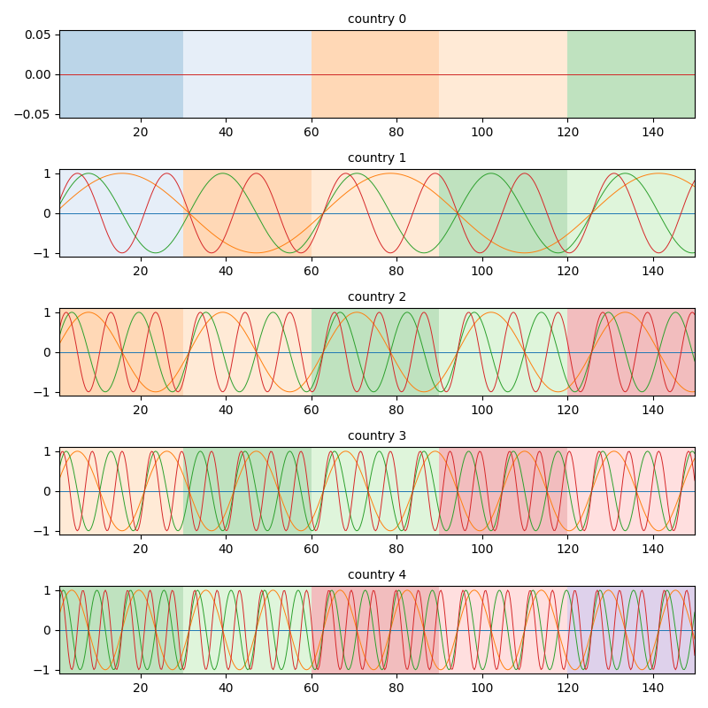

# TensorPlot
- This application plots a third-order tensor like (time, location, variable).
- This is still under development.

## Customize
- shift between pictures
- linewidth
- label
- title
- length
- figsize
- background color

## Usage
### Simple Tensor
``` python
    times = np.arange(1, 150, 0.3)
    tensors = np.array([[sin_func(times, 0.1 * i * j) for j in range(4)] for i in range(5)])
    tpl = TensorPlot()
    for i, series in enumerate(tensors):
        series = Series(times, series.transpose(), linewidth=0.7)
        series.set_title(f"country {i}")
        labels = ["series1", "series2", "series3", "series4"] if i == len(tensors) - 1 else []
        series.set_legend(labels)
        tpl.add_series(series)
    tpl.set_alpha(220)
    tpl.plot_tensor("outputs/sample1.png")
```



### Regime Plot
``` python
    # colormap
    cmap_names = ["tab20", "tab20b", "tab20c", "Set3"]
    cm_colors = []
    for cmap_name in cmap_names:
    cmap = matplotlib.colormaps.get_cmap(cmap_name)
    cm_colors += list(cmap.colors)
    # plot
    times = np.arange(1, 150, 0.3)
    tensors = np.array([[sin_func(times, 0.1 * i * j) for j in range(4)] for i in range(5)])
    tpl = TensorPlot()
    for i, series in enumerate(tensors):
        series = Series(times, series.transpose(), linewidth=0.7)
        labels = ["series1", "eries2", "series3", "series4"] if i == len(tensors) - 1 else []
        series.set_legend(labels)
        for j in range(5):
            series.draw_background(j*30, (j+1)*30, cm_colors[i+j], alpha=0.3)
        tpl.add_series(series)
    tpl.set_alpha(220)
    tpl.plot_tensor("outputs/sample2.png")
```



### Flat Plot
``` python
    times = np.arange(1, 150, 0.3)
    tensors = np.array([[np.sin(0.1 * i * j * times) for j in range(4)] for i in range(5)])
    tpl = TensorPlot()
    for i, series in enumerate(tensors):
        series = Series(times, series.transpose(), linewidth=0.7)
        series.set_title(f"country {i}")
        for j in range(5):
            series.draw_background(j * 30, (j + 1) * 30, cm_colors[i + j], alpha=0.3)
        tpl.add_series(series)
    tpl.plot_flat("outputs/sample3.png")
```

