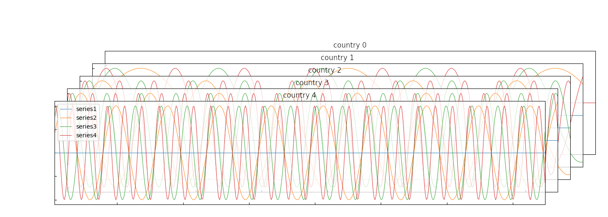

# TensorPlot
- This application plots a third-order tensor like (time, location, variable).
- This is still under development.

## Customize
- linewidth
- label
- title
- length
- figsize

## output
### Simple Tensor
``` python
    times = np.arange(1, 150, 0.3)
    tensors = np.array([[sin_func(times, 0.1 * i * j) for j in range(4)] for i in range(5)])
    tpl = TensorPlot()
    for i, series in enumerate(tensors):
        labels = ["series1", "series2", "series3", "series4"] if i == len(tensors) - 1 else []
        tpl.add_series(Series(times, series.transpose(), title=f"country {i}", labels=labels, linewidth=0.7))
    tpl.set_alpha(220)
    tpl.plot_tensor("outputs/sample1.png")
```

